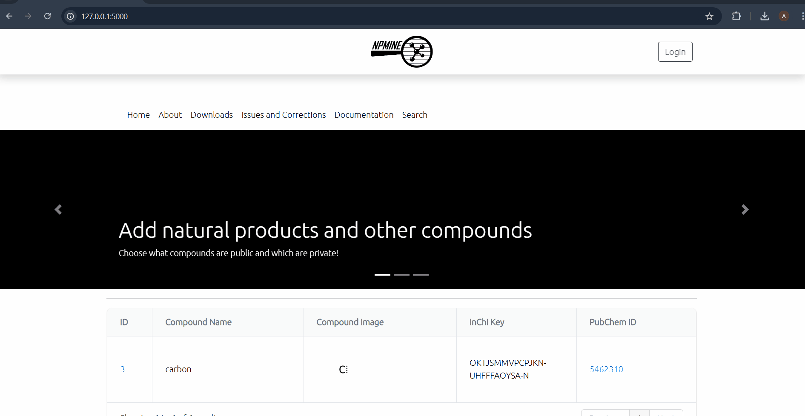
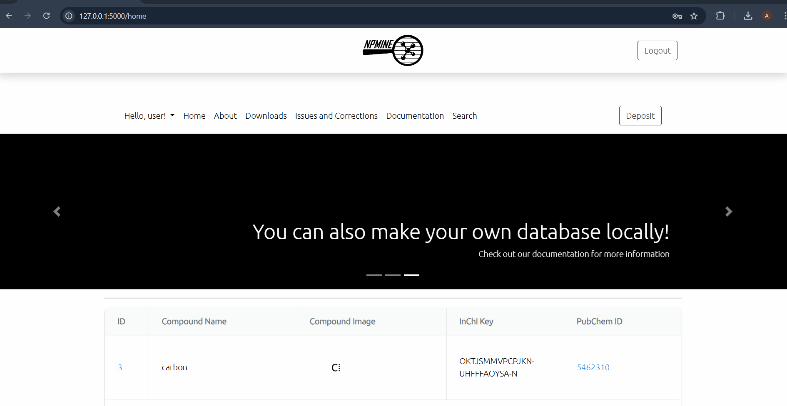
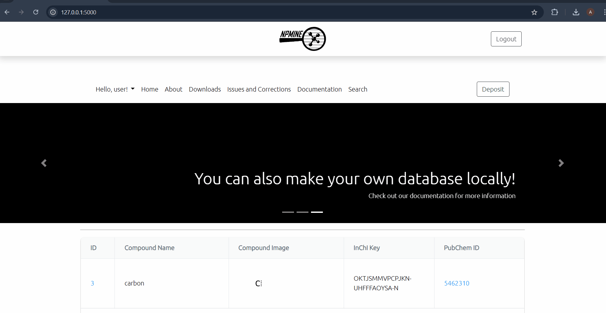
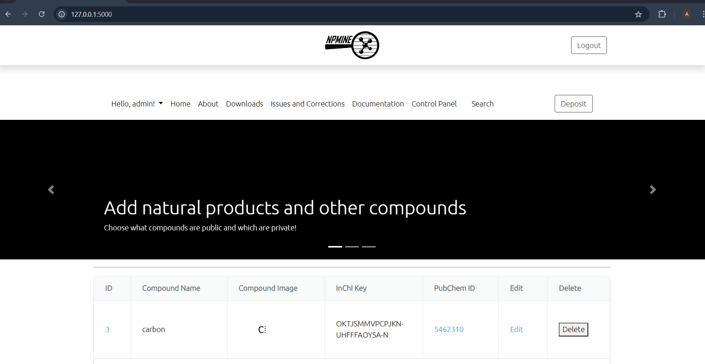
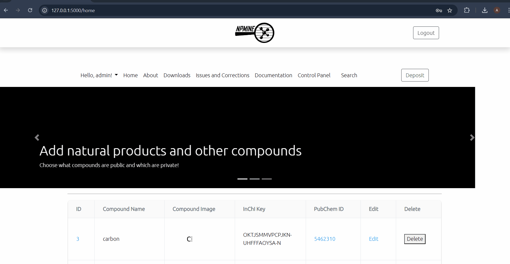
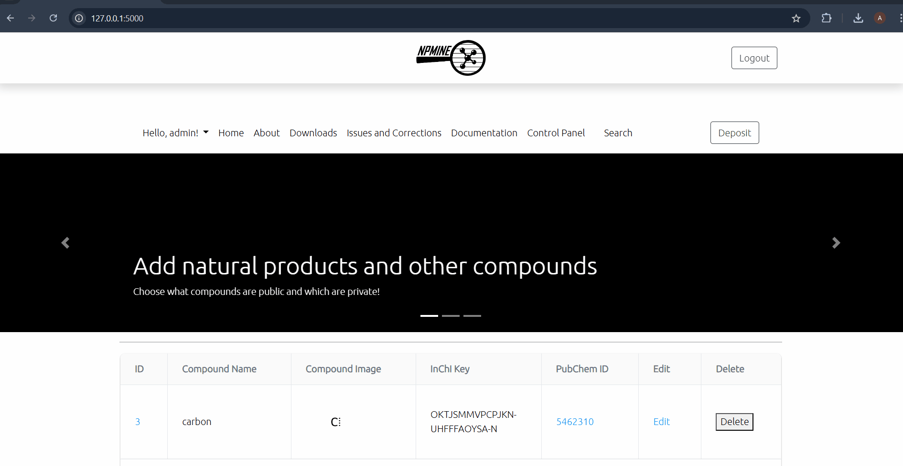

# NPMINE Online Database


NPMINE Online Database was created as an extension of [NPMINE](https://github.com/computational-chemical-biology/npmine) and, therefore, stores chemical and phylogenetic information from scientific literature. Users can also use NPMINE Online Database as an online management system, choosing whether the information deposited remains public or private. Although initially developed as a companion to NPMINE, NPMINE Online Database can be used apart from it with users being able to insert information manually from any source of scientific literature and, although initially having a focus on natural products, any compound can be deposited. Optionally, users can use NPMINE Online Database with Docker.


## Installation

### OPTION 1: RUN LOCALLY USING DOCKER

**1.** After cloning the repository, create a **.env** alongside where the Dockerfile is located

**2.** The .env should have the following elements that need to be filled in with no quotations:

```
SQLALCHEMY_DATABASE_URI=<>
SECRET_KEY=<>
SQLALCHEMY_TRACK_MODIFICATIONS=False
TEMP_FOLDER=/app/temp
MAIL_SERVER=smtp.googlemail.com
MAIL_PORT=587
MAIL_USE_TLS=True
EMAIL_USER=<>
EMAIL_PASS=<>
DB_HOST=<>
DB_PORT=<>
DB_NAME=<>
DB_USER=<>
DB_PASSWORD=<>
NPMINE_WEB_APP_PASSWORD=<>
NPMINE_WEB_APP_EMAIL=<>
```

**3.** You should have Docker already installed in your system and run the following command: 

```docker-compose --env-file .env up --build -d```

**4.** You should be able to access NPMINE Online Database with the following URL: https://localhost:5000 and login using the user and password defined in NPMINE_WEB_APP_EMAIL and NPMINE_WEB_APP_PASSWORD.

### OPTION 2: USE ONLINE


**1.** Access URL link: <>


## FUNCTIONALITIES

### SIGNUP



### DEPOSITING COMPOUNDS

You can deposit compounds and it will be private as default.



### CHECKING OUT DEPOSITED COMPOUNDS

Once you've created an account, your profile page will show the public/private compounds you've deposited.



### SEARCHING

You can search by compound, DOI, taxa and structure of compounds.



### ADMINS AND EDITORS: EDITING COMPOUNDS


### ADMINS AND EDITORS: DELETING COMPOUNDS



### ADMINS: CONTROL PANEL

Admins can control the access of other users.

